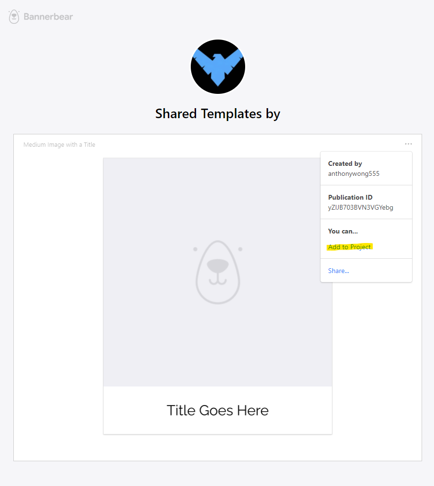
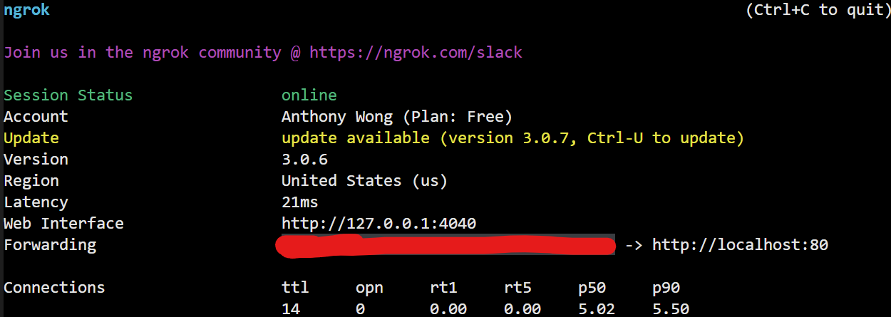

# Stable Diffusion SMS


This application allows you to use [Stable Diffusion](https://stability.ai/blog/stable-diffusion-public-release) on the go via SMS.

## Prerequisite

You will need the following:

- [Twilio Account SID and Auth Token](https://www.twilio.com/console)
- [Twilio API Key](https://www.twilio.com/docs/iam/keys/api-key)
- [Twilio Phone Number](https://console.twilio.com/us1/develop/phone-numbers/manage/search?frameUrl=%2Fconsole%2Fphone-numbers%2Fsearch%3Fx-target-region%3Dus1&currentFrameUrl=%2Fconsole%2Fphone-numbers%2Fsearch%3FisoCountry%3DUS%26searchTerm%3D%26searchFilter%3Dleft%26searchType%3Dnumber%26x-target-region%3Dus1%26__override_layout__%3Dembed%26bifrost%3Dtrue)
- [Dreamstudio API Key](https://beta.dreamstudio.ai/membership)
- [ngrok](https://ngrok.com/)
- [Docker](https://www.docker.com/)

## Getting Started

### Bannerbear

1. Create a [Bannerbear Account](https://www.bannerbear.com/).
2. After creating the account, you want to add this [template](https://app.bannerbear.com/s/share-oQrPcDmM1t399Mn5rQbW4Qtt) to your project.

1. Take a note of the **Template ID**. You will need this later.
2. Take a note of the **Project API Key**. You can find the API key in your Project → Settings page.

### Ngrok

1. Execute the following command:

```sh
ngrok http 8080
```

2. Take a note of the **Forwarding URL**.



### Twilio

1. Navigate to your [Twilio Phone Numbers](https://console.twilio.com/us1/develop/phone-numbers/manage/incoming).
2. Select one of your phone numbers.
3. Scroll down to the *Messaging* section.
4. Add your Forwarding URL with `/sms` append to it. It should look something like this:
```sh
https://1337.ngrok.io/sms
```
5. Click **Save**.

### Docker

1. Execute the following command:

```sh
$ git clone https://github.com/anthonywong555/Stable-Diffusion-SMS
$ cd Stable-Diffusion-SMS
$ npm install
$ cp .env-example .env
```

2. Put all your credentials in the **.env** file.

3. Execute the following command:

```sh
docker compose -f "docker-compose.dev.yml" up -d --build
```

4. Text to your Phone Number!